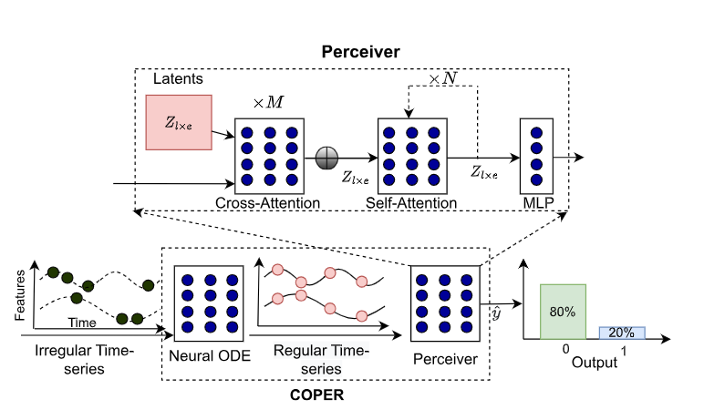
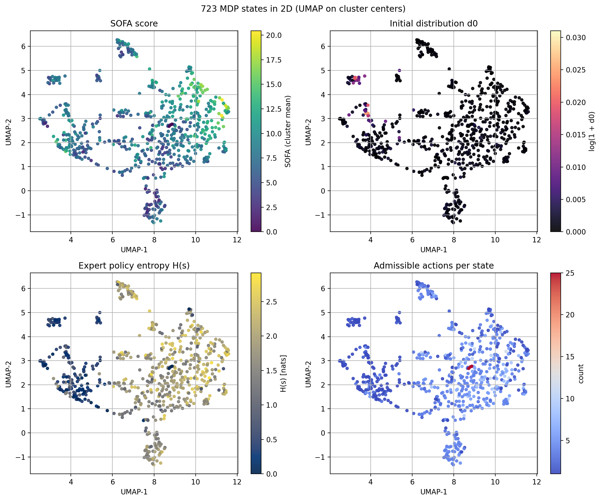
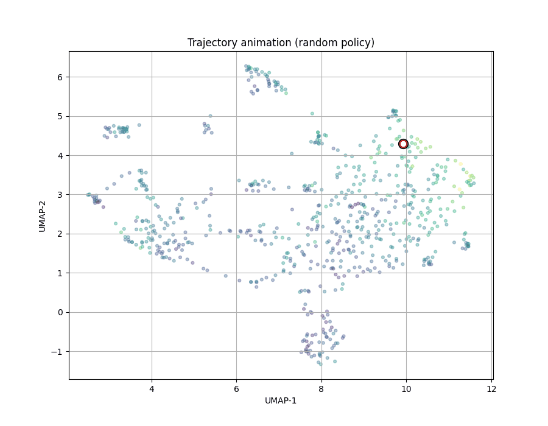
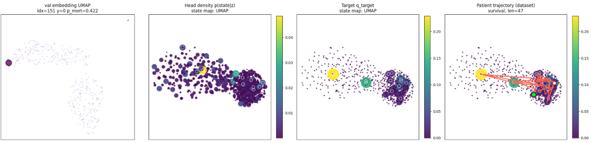

# COPER latent interpretation using MDP for clinical EHR

This directory is a **single stand alone working tree** that combines several previous lines of work:


| Track                | Role                                                                                                                                                        | Upstream                                                                                                                 |
| -------------------- | ----------------------------------------------------------------------------------------------------------------------------------------------------------- | ------------------------------------------------------------------------------------------------------------------------ |
| **COPER**            | Irregular clinical time series → latent representations, mortality benchmarks, exportable bundles                                                           | [jmdvinodjmd/COPER](https://github.com/jmdvinodjmd/COPER)                                                                |
| **ICU-Sepsis**       | Tabular sepsis MDP (Gymnasium): default **packaged** dynamics, or **rebuilt** matrices from the unified MIMIC build (see `notebooks/icu_sepsis_demo.ipynb`) | [icu-sepsis/icu-sepsis](https://github.com/icu-sepsis/icu-sepsis) · [ICU-Sepsis paper](https://arxiv.org/abs/2406.05646) |
| **Policy baselines** | SARSA, Q-learning, DQN, PPO, SAC on the ICU-Sepsis env (vendored experiment code)                                                                           | [Dhawgupta/choudhary2024icu](https://github.com/Dhawgupta/choudhary2024icu)                                              |


## COPER model

- **Input**: irregularly sampled multivariate clinical series (e.g. MIMIC benchmark tensors).
- **Core**: attention over continuous-time / irregular structure + optional ODE-inspired components (`src_coper/`).
- **Outputs**: task heads (e.g. in-hospital mortality) and **exportable latent bundles** for downstream analysis (`utils/export_coper_checkpoint.py`, `load_coper_bundle.py`, `coper_embed.py`).

Implementation largely taken from the in the original COPER reference repository.



## **ICU-Sepsis MDP: key basic formulas from [ICU-Sepsis (arXiv:2406.05646)](https://arxiv.org/abs/2406.05646)**

**Setup.** Discrete states **{0,…,S−1}** for the loaded dynamics; positive actions **A⁺ = {0,…,24}**; discount **γ = 1**. The **packaged** repo assets use **S = 716** with death / survival / **s_inf** at **713 / 714 / 715** and survival reward **+1** at state **714** (see paper). A **rebuilt** cohort (unified build) may yield a different **S** after pruning; `ICUSepsisEnv` always treats the **last three** indices as those terminals (`state_death`, `state_survival`, `state_s_inf` on the env instance).

**Transition counts** over trajectories *h* in the empirical dataset **D**:

```text
C(s,a,s′) = Σ_{h,t} I[ S_t = s  and  A_t = a  and  S_{t+1} = s′ ]     |     C(s,a) = Σ_{s′} C(s,a,s′)
```

(*I[·]* is the indicator: 1 when the event holds, 0 otherwise.)

**Admissible actions** (threshold **τ**, e.g. **20**): *a* ∈ **A(s)** iff **C(s,a) ≥ τ**. Inadmissible *(s,a)* pairs are mapped to the **average** of admissible transitions from *s*, keeping a full **|S| × |A⁺|** table.

**Empirical dynamics and expert policy**

```text
p(s′ | s,a) = C(s,a,s′) / C(s,a)          when a ∈ A(s)

π_expert(a | s) = C(s,a) / ( Σ_{ã} C(s,ã) )
```

**Initial distribution** *d*₀(*s*): empirical mass on the first state of each trajectory.

**Optimal policy.** From *p* and reward *R*, value iteration gives value function `V`* and policy `π`* satisfying:

```text
π*(s) ∈ arg max_a Q*(s,a)
```

Code: `icu_sepsis_helpers.utils.mdp.value_iteration` (baselines and `train_mdp_policies.ipynb`).

**Objective.** With **γ = 1**, expected return equals survival probability for this reward.

**Illustration.** Discrete states in 2D (UMAP of cluster centers): SOFA, initial distribution *d*₀, expert-policy entropy *H*(*s*), and admissible-action counts (rebuilt cohorts may use a different **S**; this panel uses **723** states). Reproduced in `notebooks/icu_sepsis_demo.ipynb` (UMAP / trajectory section).



Random-policy rollout projected onto the same kind of UMAP view (states colored by SOFA):



### Small head: COPER latent → MDP trajectory

After COPER produces a patient-level embedding **z**, a lightweight head is trained to match a **target distribution over MDP states** derived from the patient’s ICU trajectory (histogram / occupancy in state space), minimizing KL to **p(state | z)**. The figure below is one **validation** patient (**idx 151**): **left**, UMAP of validation embeddings with that patient highlighted; **next**, the head’s predicted density over MDP states (same UMAP layout); **then**, the empirical target from the trajectory; **right**, the observed state sequence (**length 47**, non-mortality label, COPER mortality probability **≈ 0.42**, reference trajectory aligned on the same stay).



## **Notebooks**


| **Notebook**                         | **Purpose**                                                                                                                                                                                                                                                                                                                                                                                                                                                               |
| ------------------------------------ | ------------------------------------------------------------------------------------------------------------------------------------------------------------------------------------------------------------------------------------------------------------------------------------------------------------------------------------------------------------------------------------------------------------------------------------------------------------------------- |
| `build_data.ipynb`                   | Runs unified `data_mngmt` build end-to-end: default **48 h / 1 h** IHM → `generated/mortality_coper_*.data`, sepsis-filtered MDP cohort (**1 h** RL blocs by default), optional publish. Analysis/plots are in `datasets.ipynb`. `REBUILD_FROM_SCRATCH=True` forces a benchmark rebuild; `MDP_FORCE_REBUILD_SOURCE_TABLE=True` (or delete `mimic_dataset_table_src_bloc*.csv`) forces Postgres RL rebuild.                                                                |
| `icu_sepsis_demo.ipynb`              | **Gymnasium MDP demo:** value iteration, rollouts, UMAP — loads `mdp_params_<slug>/` from the unified build by default (`USE_PACKAGED_MDP=False`), or packaged `envs/assets` if `True`.                                                                                                                                                                                                                                                                                   |
| `COPERvsTRANSFORMER_mortality.ipynb` | Train and compare **COPER vs Transformer** on MIMIC mortality tensors (default **no input-time** `--drop`; `NITERS_LIST` typically **1, 3, 10** — keep in sync with `display_embeddings.ipynb`). Also fits **logistic (L2/L1), random forest, PyTorch LSTM**; saves `.joblib` / `.pt` baselines under `results/demo_outputs/coper_vs_transformer_mortality/models/`. Exports deep bundles to the run’s `models/`; tables + `mimic3_baselines_*.csv/json` → `.../tables/`. |
| `display_embeddings.ipynb`           | Latent PCA/UMAP/t-SNE; figures and caches → `results/demo_outputs/display_embeddings/{figures,latents}/`.                                                                                                                                                                                                                                                                                                                                                                 |
| `latent_dim.ipynb`                   | Latent-dim sweep; CSV/PNGs → `results/demo_outputs/latent_dim_sweep/{tables,figures}/`.                                                                                                                                                                                                                                                                                                                                                                                   |
| `COPER_demo.ipynb`                   | Quick MIMIC + COPER demo; demo checkpoint → `results/demo_outputs/coper_demo/models/`.                                                                                                                                                                                                                                                                                                                                                                                    |
| `coper_to_states.ipynb`              | Map latents to MDP states; trained head → `results/demo_outputs/coper_to_states/models/`.                                                                                                                                                                                                                                                                                                                                                                                 |
| `train_mdp_policies.ipynb`           | Train tabular RL on ICU-Sepsis; compare random, expert, **optimal** (value iteration), and learned policies (`os.chdir` into `policies/` as noted in the notebook).                                                                                                                                                                                                                                                                                                       |
| `datasets.ipynb`                     | Side-by-side stats: COPER mortality pickle vs MDP cohort / params (`data_mngmt/tools/dataset_compare.py`), plus post-build 48 h / 1 h checks.                                                                                                                                                                                                                                                                                                                             |


## Data preprocessing from MIMIC for experiments

After setting up a venv with `scripts/setup_venv.sh`, set `physionet_mimic_root` in `paths.json` to the MIMIC-III CSV **release directory** that **contains** `PATIENTS.csv` (typically `.../physionet.org/files/mimiciii/1.4/`, not the parent `physionet.org` folder). The dataset is restricted—acquire it through [PhysioNet](https://physionet.org/). Then run `notebooks/build_data.ipynb` with default parameters, or `python -m data_mngmt` (same unified CLI as the notebook).

**Default unified build** (`data_mngmt.pipeline.unified_build.UnifiedBuildParams`): **sepsis cohort**, **1 h** discretizer step, **48 h** IHM horizon, MDP build enabled → build slug `sepsis-60m-h48ihm`.

**Artifacts produced**


| Output                                             | Role                                                                                                                                                                                                                                                                                                                                                                                                                                                                            |
| -------------------------------------------------- | ------------------------------------------------------------------------------------------------------------------------------------------------------------------------------------------------------------------------------------------------------------------------------------------------------------------------------------------------------------------------------------------------------------------------------------------------------------------------------- |
| `data_mngmt/generated/mortality_coper_<slug>.data` | Pickle tuple `(details, X_train, y_train, X_val, y_val, X_test, y_test, None)`: mimic3-benchmarks-style IHM tensors after discretizer + normalizer; time length matches `horizon_hours / timestep_hours` (defaults → **48** steps × **1 h**). Labels are binary in-hospital mortality. `details` holds provenance, shapes, and per-split `icustay_id` arrays aligned with rows (for joins to the MDP table). Point `paths.json` → `mimic3_mortality` at this file for training. |
| `data_mngmt/generated/unified/<slug>/`             | Ephemeral benchmark tree: `root/` (episode CSVs), `in-hospital-mortality/` (IHM listfiles + splits), optional `mdp_cohort_<slug>.csv` / `mdp_params_<slug>/`, and `unified_build.json` (full manifest + summaries).                                                                                                                                                                                                                                                             |
| `mdp_cohort_<slug>.csv`                            | Prepared RL-style cohort (ICU stay rows + `mortality_inhospital` from MIMIC `ADMISSIONS`) fed into `icu_sepsis_helpers` MDP creation.                                                                                                                                                                                                                                                                                                                                           |
| `mdp_params_<slug>/`                               | Tabular dynamics and related MDP parameters from `build_mdp_from_sepsis_cohort`.                                                                                                                                                                                                                                                                                                                                                                                                |
| `coper_mdp_alignment_<slug>.json`                  | Alignment metadata between the COPER pickle and the MDP cohort (`data_mngmt.contracts.alignment_utils`).                                                                                                                                                                                                                                                                                                                                                                        |
| `paths.json` → `icu_sepsis_csv_tables_dir`         | When publish succeeds: `mimic_dataset_table.csv` (RL table), optional `mdp_cohort_prepared.csv`, plus `PUBLISHED_FROM_UNIFIED_BUILD.txt`.                                                                                                                                                                                                                                                                                                                                       |
| `icu_sepsis/.../envs/assets/`                      | Default load path for `gym.make("Sepsis/ICU-Sepsis-v2")` **without** `params=`. After an MDP build, copy fresh `dynamics.npz` + sidecars here with `python -m data_mngmt.tools.publish_icu_sepsis_env_assets --mdp-dir …`, or pass `--publish-gym-env-assets` to `python -m data_mngmt`. Alternatively, pass `params=MDPParameters(mdp_params_dir)` from Python (see `notebooks/icu_sepsis_demo.ipynb`).                                                                        |


**Cohort note.** With defaults, IHM listfiles and MDP rows are restricted to **sepsis-flagged** `ICUSTAY_ID`s from PhysioNet tables (`data_mngmt.mimic.sepsis_icustays`). The MDP source table follows the **AI Clinician** / `mimic_sepsis` schema (one row per time bloc). `mdp_rl_bloc_interval_hours` **defaults to 1** (same spacing as COPER’s 1 h bins); pass `--mdp-rl-bloc-interval-hours 4` (or set `MDP_RL_BLOC_INTERVAL_HOURS = 4` in the notebook) if you want coarser RL rows. **Snapshot reuse:** after a successful Postgres run, `generated/unified/<slug>/mimic_dataset_table_src_bloc<N>h.csv` is written; later runs **reuse** that file if it exists unless you pass `--mdp-force-rebuild-source-table` or set `mdp_force_rebuild_source_table=True` (same knob in `UnifiedBuildParams`).

**COPER vs MDP time span.** The **COPER** IHM tensors use the benchmark’s **first 48 h from ICU admission** (fixed upstream). The **MDP** RL table rows are **not** limited to that 48 h window—they typically span the **whole ICU stay** in sequential blocs. Join/analysis uses `ICUSTAY_ID` and shared in-hospital mortality labeling, not a shared 48 h slice.

After a build, use `notebooks/datasets.ipynb` for COPER vs MDP sanity checks (cohorts, blocs, label agreement). `notebooks/icu_sepsis_demo.ipynb` loads the **rebuilt** tabular MDP by default (`mdp_params_<slug>/`, aligned with the unified build) or optionally the legacy packaged dynamics.

**MIMIC preprocessing** uses [YerevaNN/mimic3-benchmarks](https://github.com/YerevaNN/mimic3-benchmarks)-style tensors, and **AI Clinician**–style cohort construction via [microsoft/mimic_sepsis](https://github.com/microsoft/mimic_sepsis) (see also Komorowski et al., *Nature Medicine* 2018, [doi:10.1038/s41591-018-0213-5](https://doi.org/10.1038/s41591-018-0213-5)) to build the MDPs.

---

## Repository layout

```
code/COPER/
├── README.md                 # this file (single source of truth for docs)
├── requirements.txt          # unified Python dependencies for COPER + notebooks + MDP
├── LICENSE
├── paths.json                # local path hints (MIMIC extracts, pickles, ICU-Sepsis CSV dir)
├── figures/                  # docs: `coper_architecture.png`, `icu_sepsis_umap_states_2x2.png`, `mapping.png` (latent→MDP head), ICU-Sepsis trajectory (`umap_trajectory_random.gif`, see formulas section)
├── data_mngmt/               # PhysioNet → benchmarks → COPER pickle + ICU-Sepsis MDP (see below)
├── src_coper/                # COPER core: attention, ODE cell, transformer baseline, losses
├── utils/                    # training entrypoint, export/load bundles, embeddings, viz, mortality baselines (`lstm.py`, `regression.py`, `random_forest.py`)
├── notebooks/                # analysis and demos (see below)
├── scripts/                  # e.g. setup_venv.sh
├── results/                  # runs/, checkpoints/, models/, …; notebook exports under ``demo_outputs/<notebook>/{figures,tables,models,latents,…}/`` (``notebook_demo_dir``)
├── policies/                 # vendored RL algorithms (src/algos, experiments/, run/, analysis/)
│   └── (run from this dir: os.chdir in train_mdp_policies.ipynb)
└── icu_sepsis/               # vendored ICU-Sepsis environment + helpers
    ├── icu_sepsis/           # installable package: Gymnasium env + packaged dynamics.npz
    ├── icu_sepsis_helpers/   # value iteration, baselines, MDP rebuild utilities
    └── examples/             # quickstart, MDP stats, `rebuild_env_assets.py` (cohort → dynamics → package assets)
```

---

## Setup

From `code/COPER/`:

```bash
python -m venv .venv-coper
source .venv-coper/bin/activate   # Windows: .venv-coper\Scripts\activate
pip install -r requirements.txt
```

**ICU-Sepsis dynamics (**`Sepsis/ICU-Sepsis-v2`**)**

- By default the env loads `dynamics.npz`, `metadata.json`, and `admissible_actions.txt` from `icu_sepsis/icu_sepsis/icu_sepsis/envs/assets/` (see `ICUSepsisEnv` in `icu_sepsis/icu_sepsis/icu_sepsis/envs/sepsis.py`). The repo ships a baseline copy; you can **replace** it with dynamics estimated from your cohort, or pass `params=MDPParameters(path_to_mdp_params_dir)` so the default asset folder is untouched (`notebooks/icu_sepsis_demo.ipynb` does this for the unified build output).

**Rebuild and install into the package (typical)**

1. Build tabular MDP parameters from an AI Clinician–style RL CSV (same pipeline as the unified MIMIC build): output directory contains `dynamics.npz` and the sidecars (`icu_sepsis_helpers.build.build_mimic_params`, wrapped by `data_mngmt.pipeline.build_mdp.build_mdp_from_sepsis_cohort`).
2. Copy those files into the package assets folder:

```bash
# After e.g. data_mngmt/generated/unified/sepsis-60m-h48ihm/mdp_params_sepsis-60m-h48ihm exists:
python -m data_mngmt.tools.publish_icu_sepsis_env_assets \
  --mdp-dir data_mngmt/generated/unified/sepsis-60m-h48ihm/mdp_params_sepsis-60m-h48ihm
```

Or combine the full MIMIC unified build with an automatic copy:

```bash
python -m data_mngmt --publish-gym-env-assets
```

Or build from a cohort CSV and publish in one step:

```bash
python icu_sepsis/examples/rebuild_env_assets.py \
  -i data_mngmt/generated/icu_sepsis_csv_tables/mimic_dataset_table.csv
```

(`--outcome-column` must match your CSV, e.g. `mortality_inhospital` for the unified pipeline.)

- **Custom path without overwriting package files:** `gym.make("Sepsis/ICU-Sepsis-v2", params=MDPParameters(path_to_dir))` (see `icu_sepsis/examples/build_mimic_demo.py`).
- Optional CSV tables: paths in `paths.json`; see **Data preprocessing** above and [icu-sepsis](https://github.com/icu-sepsis/icu-sepsis).

---

## Policy experiments (`policies/`)

This tree is a **copy** of the upstream experiment layout. Typical workflow:

```bash
cd policies
python src/mainjson.py experiments/debug.json 0
```

Sweep / analysis / plots (when you use the full upstream pipeline):

```bash
python run/local.py -p src/mainjson.py -j experiments/debug.json
python analysis/process_data.py experiments/debug.json
python analysis/learning_curve.py y returns auc experiments/debug.json
```

